# BP 실습 2-2
Vue2 문법을 Vue3 문법으로 전환

## 제출 정보
- **GitHub 저장소**: <https://github.com/ansangah/BP2-2>
- **변경 요약**:
  1) **컴포넌트 마이그레이션**  
     - `src/components/example1` ~ `example6`의 모든 컴포넌트를 Options API에서 Composition API 기반 `<script setup>` 구조로 전환.  
     - 반응형 상태(`ref`, `reactive`), 계산 속성(`computed`), 라이프사이클 훅(`onMounted`, `onBeforeUpdate` 등)을 Composition API 방식으로 재작성.
  2) **상호작용 로직 정비**  
     - 부모-자식 통신, provide/inject 등 예제별 시나리오에 맞춰 `defineProps`, `defineEmits`, `provide`, `inject`를 사용하도록 수정.  
     - 이벤트 전달, 데이터 주입 및 DOM 참조(`ref`) 기능이 Vue 3 스타일로 동일하게 동작하도록 보완.
  3) **프로젝트 설정 개선**  
     - `.eslintrc.js`에 Vue 컴파일러 매크로 전역 선언을 추가해 `defineProps`, `defineEmits`, `defineExpose` 등을 ESLint가 인식하도록 구성.  
     - `App.vue`를 `<script setup lang="ts">`로 정리하고 현재 데모로 확인할 컴포넌트를 명시적으로 렌더.
- **동작 확인 스크린샷**  

  | 흐름 | 캡처 |
  | --- | --- |
  | E01 화면 | 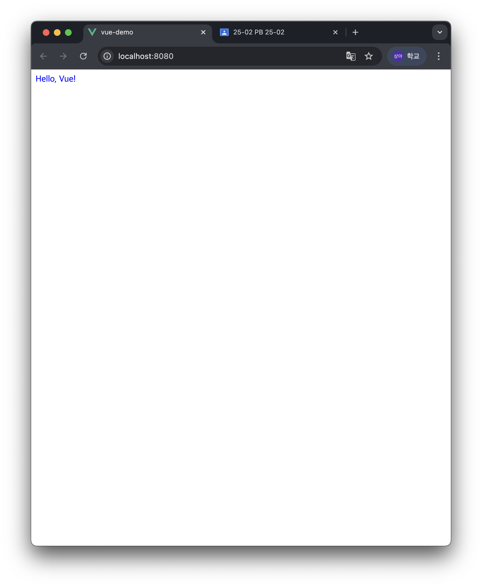 |
  | E02 화면 | 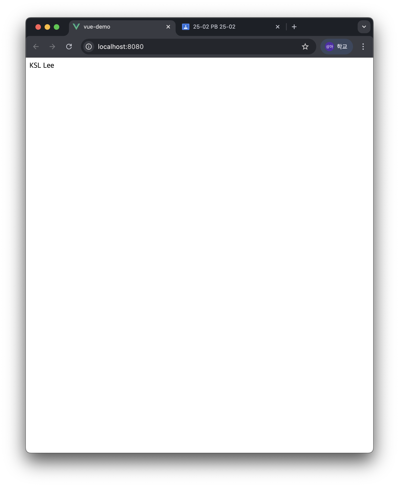 |
  | E03 화면 | 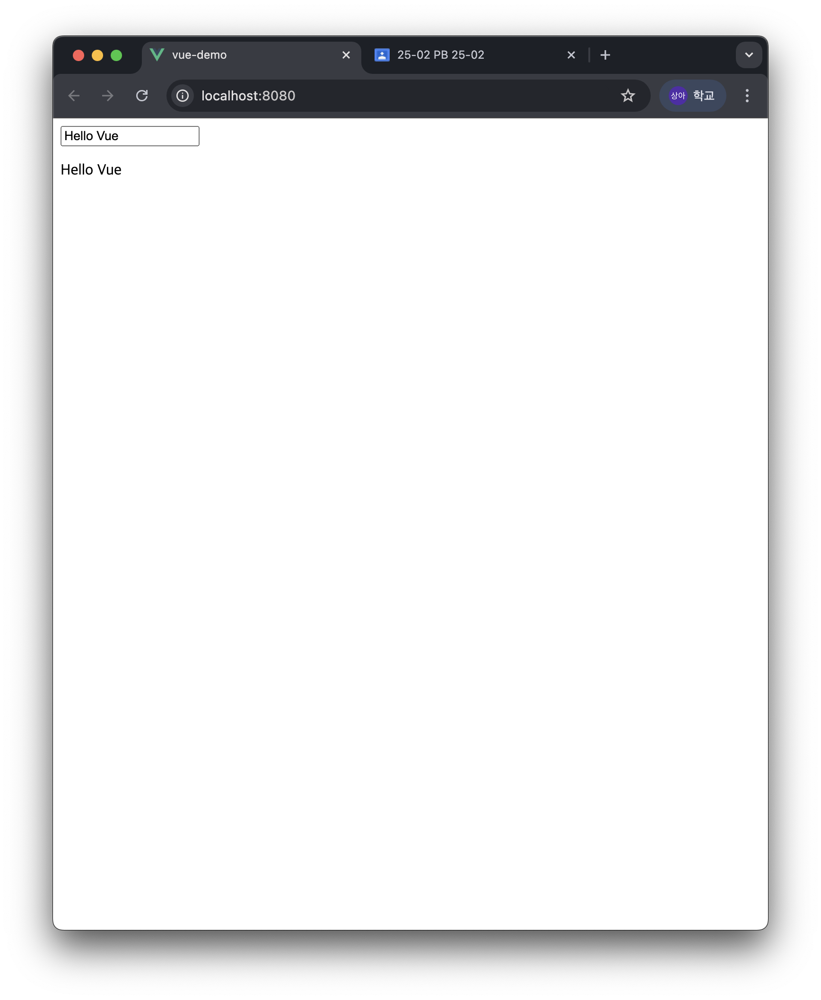 |
  | E04 화면 | 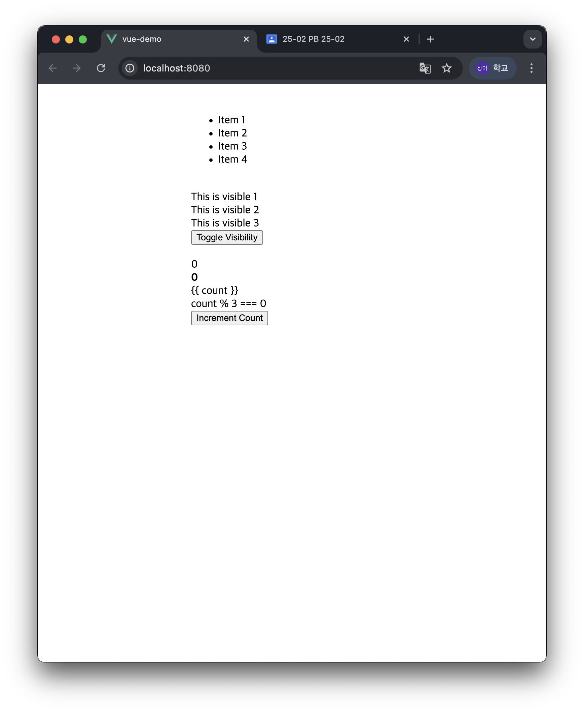 |
  | E05 화면 | 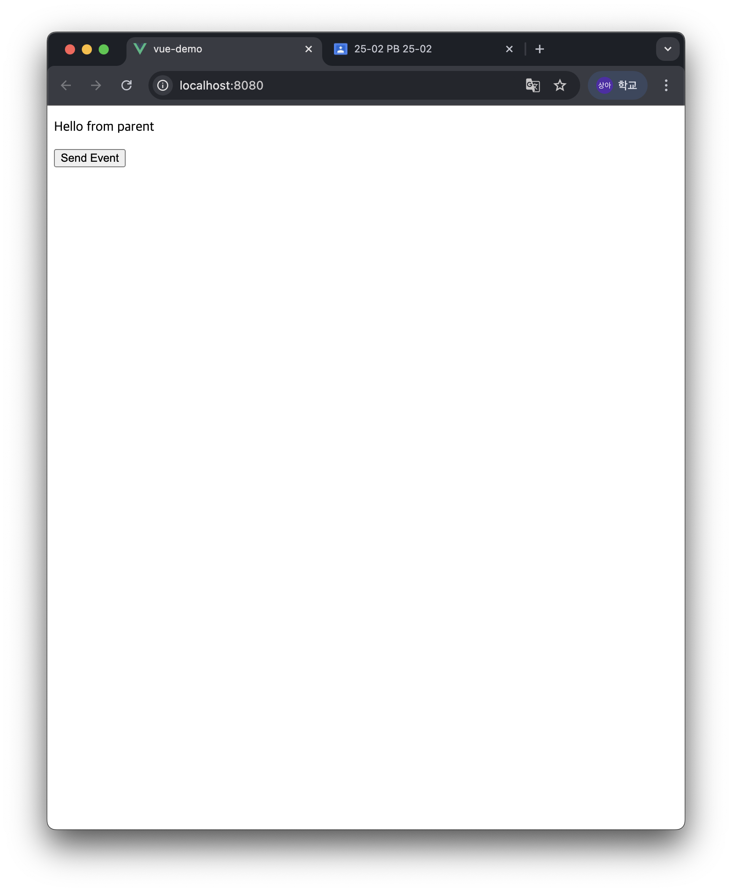 |
  | E06 화면 | 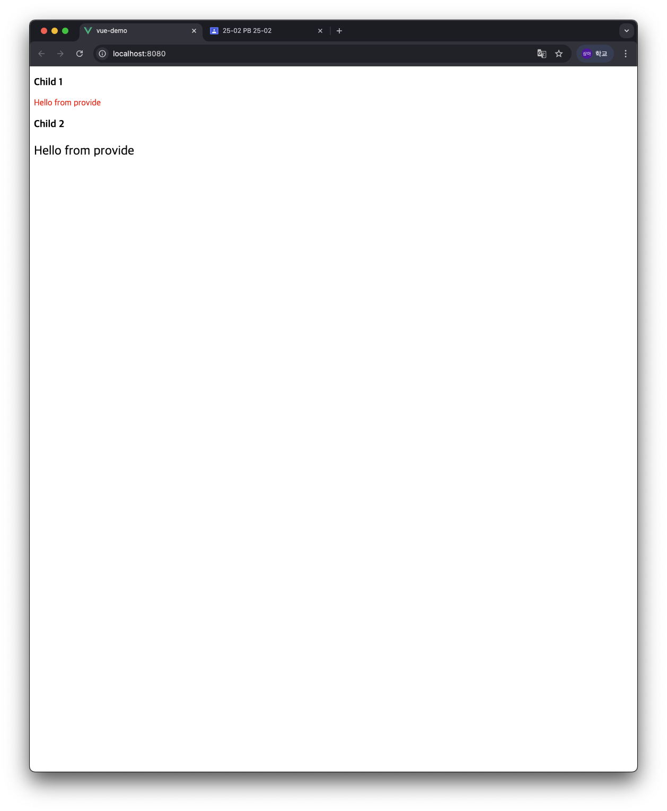 |
  | E07 화면 | 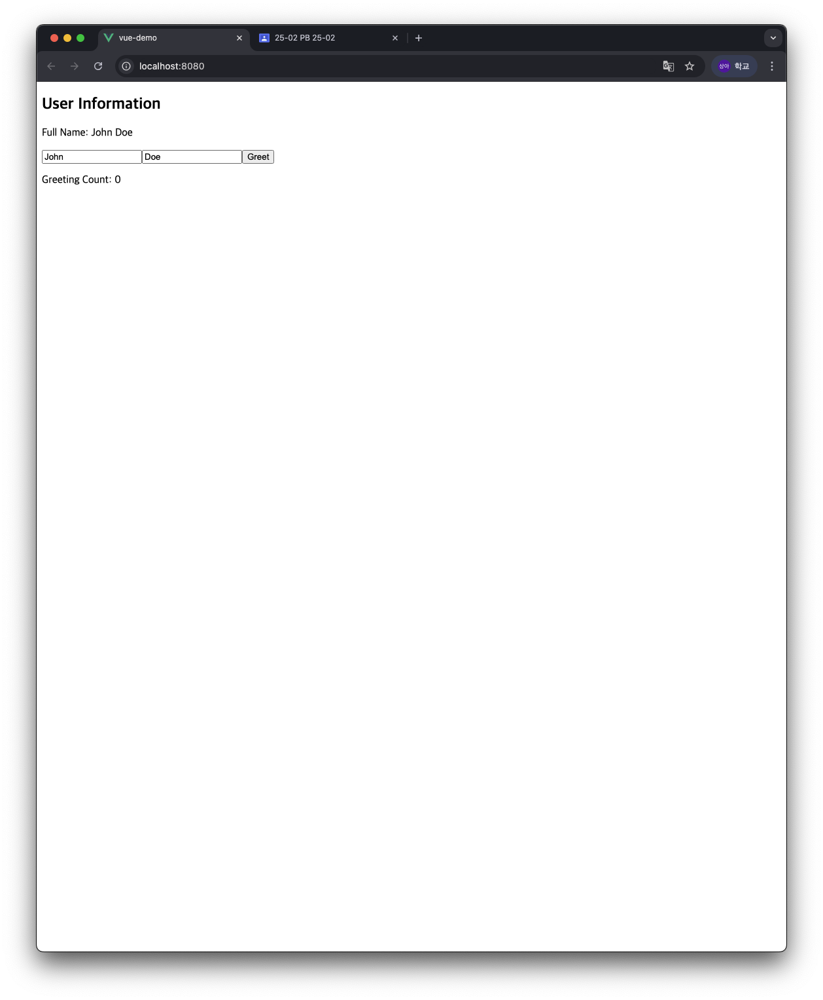 |
  | E08 화면 |  |
  | E09 화면 | 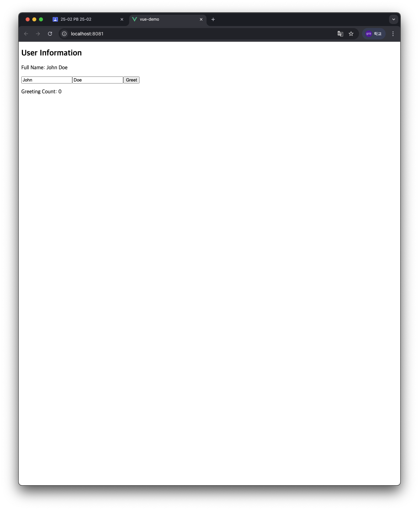 |
  | E10 화면 | 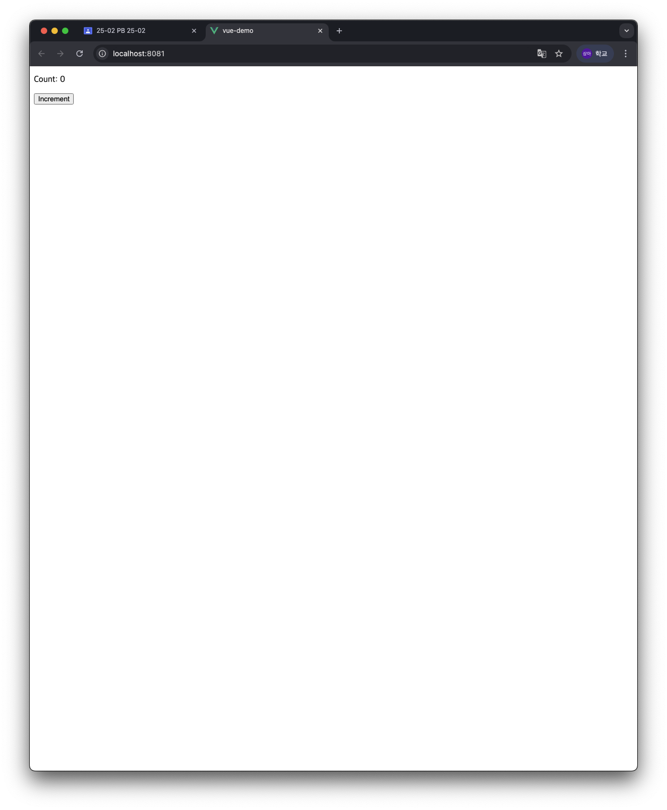 |
  | E11 화면 | 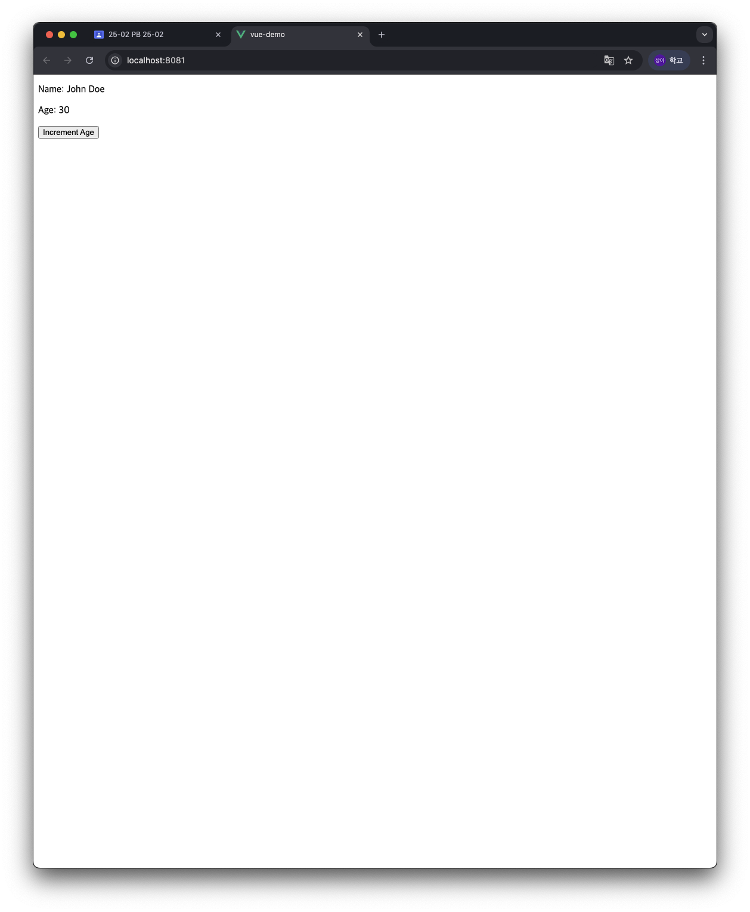 |
  | E12 화면 | 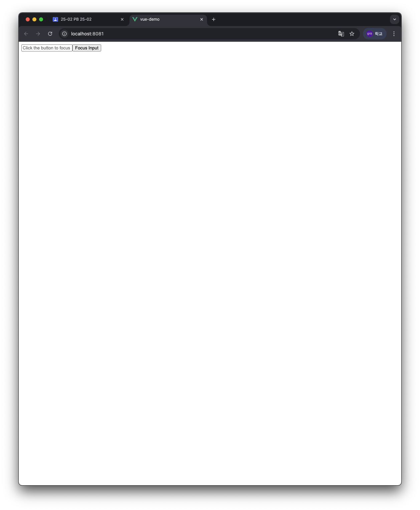 |
